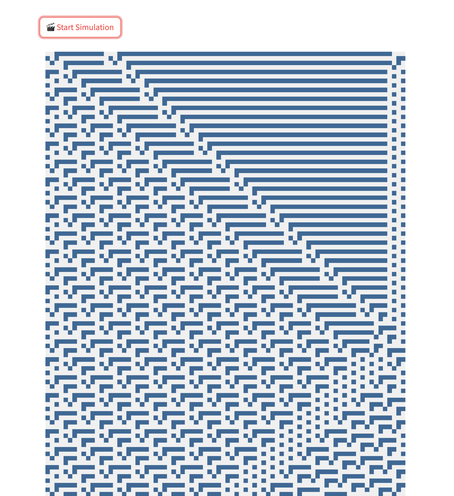

# Cellular Automaton
## A Streamlit-based Cellular Automaton

ℹ️ This is an interactive cellular automaton simulation, realized in streamlit. Inspired by David Sumpter's book The Four Ways of Thinking and his vivid description of Stephen Wolfram's Elementary Cellular Automaton. 
Depending on the transition rules, one can create I) stable, II) periodic, III) chaotic or IV) complex behaviour.

📕 Book: https://www.goodreads.com/book/show/61242231-four-ways-of-thinking

⑇ Wolframs Automaton: https://en.wikipedia.org/wiki/Elementary_cellular_automaton 

## Setup 
You can define
- the number of cells
- the number of transition rounds
- the initial sequece of 0s and 1s. 

## Run
press "🎬 Start Simulation to generate your idivitual Cellular Automaton" sequence.

